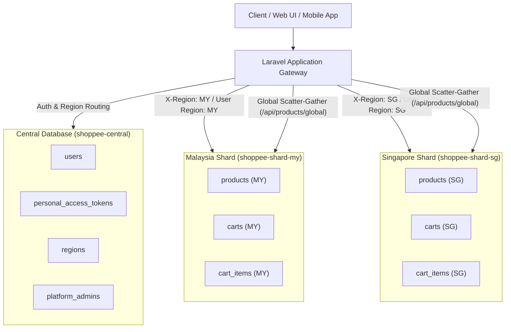

# 🛒 Shoppee-Asia Hub

<p align="center">
  
</p>

<p align="center">
  <strong>Multi-Region Sharded E-Commerce Platform</strong>
</p>

<p align="center">
  
  
  
  
  
  
</p>

---

## 📖 Overview

**Shoppee-Asia Hub** is a scalable, multi-region e-commerce web application engineered with **Laravel 12**, **PostgreSQL**, and **Docker**. It is designed with a **database sharding architecture** tailored for Southeast Asian markets (e.g., Malaysia `MY`, Singapore `SG`).

The platform separates global identity and regional cluster data, allowing horizontal scaling, regional isolation, low-latency queries, and seamless cross-shard catalog aggregation.

---

## ✨ Key Features

- **🌐 Multi-Region Database Sharding**:
  - **Central Database (`shoppee-central`)**: Manages identity, user accounts, authentication tokens, region metadata, and platform administrators.
  - **Regional Shard Databases (`shoppee-shard-my`, `shoppee-shard-sg`)**: Encapsulates region-specific product inventories, carts, and order details.
- **⚡ Dynamic Shard Routing & Scatter-Gather**:
  - Automatic connection routing based on user session, authenticated profile, request headers (`X-Region`), or payload.
  - Scatter-gather catalog query (`/api/products/global`) that queries and combines inventories across all active regional shards.
- **🔐 Authentication & Role Management**:
  - Token-based API authentication via **Laravel Sanctum**.
  - Dual session & API support for `seller` and `user` roles.
- **📦 Seller & Product Management**:
  - Dedicated Seller Portal (`/seller-home`) with catalog overview, inventory tracking, and SKU management.
  - Product creation, updates, and seller-scoped queries dynamically committed to the correct regional database shard.
- **🛍️ Cart & Checkout Flow**:
  - Persistent regional carts with dynamic item tracking.
  - Multi-region product detail (`/product-page-id/{id}`) and regional checkout interfaces (`/checkout-page-id/{id}/{regionCode}`).
- **💳 Payment Gateway Integration (Xendit)**:
  - Third-party invoice generation via Xendit API (`/api/payments/create-invoice`).
  - Webhook listener skeleton and success/failure redirect handling.
- **🛠️ Automated Developer Tooling**:
  - PowerShell automation scripts (`start.ps1`, `stop.ps1`) managing Docker Compose dependencies (PostgreSQL 16, Mailpit) and Laravel dev servers in one command.

---

## 🏛️ Architecture & Database Design

Shoppee-Asia distributes data across multiple PostgreSQL database instances:



### Database Connections Overview

| Connection | Database Name | Port | Description |
| :--- | :--- | :--- | :--- |
| `central` | `shoppee-central` | `5430` / `5432` | Global users, regions, admins, tokens |
| `shard_my` | `shoppee-shard-my` | `5430` / `5432` | Malaysia product catalog, carts, cart items |
| `shard_sg` | `shoppee-shard-sg` | `5430` / `5432` | Singapore product catalog, carts, cart items |

---

## 📁 Project Structure

```
shoppee-asia/
├── app/
│   ├── Http/
│   │   └── Controllers/
│   │       ├── Api/
│   │       │   ├── AuthController.php         # User registration & token generation
│   │       │   └── ProductController.php      # Sharded product CRUD & global catalog
│   │       ├── CartsController.php            # Cart operations & cart view rendering
│   │       ├── PaymentOrderController.php     # Xendit payment checkout & invoice handler
│   │       ├── ProductController.php          # Web product page controller
│   │       └── SellerController.php           # Seller dashboard controller
│   └── Models/
│       ├── CartItems.php
│       ├── Carts.php
│       ├── Product.php
│       ├── Region.php
│       └── User.php
├── config/
│   ├── database.php                           # Multi-database connection configurations
│   └── services.php                           # Xendit & third-party service credentials
├── database/
│   ├── migrations/
│   │   ├── central/                           # Migrations for Central database
│   │   └── shard/                             # Migrations for Regional Shard databases
│   └── seeders/
│       └── DatabaseSeeder.php                 # Master seeder for regions, sellers & products
├── resources/
│   └── views/
│       ├── auth_page.blade.php                # Authentication UI (Login / Sign Up)
│       ├── cart_page.blade.php                # Shopping cart UI
│       ├── checkout_page.blade.php            # Order checkout UI
│       ├── product_page_id.blade.php          # Single product details UI
│       ├── seller_home.blade.php              # Seller management portal
│       └── user_home.blade.php                # Customer marketplace & storefront
├── routes/
│   ├── api.php                                # API endpoints (Auth, Products, Payments)
│   └── web.php                                # Blade UI views & web routes
├── docker-compose.yml                         # PostgreSQL 16 & Mailpit container services
├── start.ps1                                  # One-click dev environment startup script
├── stop.ps1                                   # Service teardown script
└── REFERENCE.md                               # Quick reference & cheatsheet
```

---

## 🚀 Getting Started

### Prerequisites

Ensure you have the following installed on your machine:
- **PHP 8.2+** with `pdo_pgsql`, `openssl`, `mbstring` extensions
- **Composer** (v2.x)
- **Node.js** (v18+) & **NPM**
- **Docker Desktop** (running)

---

### Step 1: Clone and Configure Environment

```powershell
# 1. Clone repository
git clone https://github.com/nidqija/Shoppee-Asia-Hub.git
cd shoppee-asia

# 2. Install PHP dependencies
composer install

# 3. Install frontend dependencies
npm install

# 4. Create local environment file
cp .env.example .env

# 5. Generate application key
php artisan key:generate
```

---

### Step 2: Configure Environment Variables

Edit your `.env` file to ensure database and service credentials are set:

```env
APP_NAME=Shoppee-Asia
APP_ENV=local
APP_DEBUG=true
APP_URL=http://localhost:8000

# Central Database
DB_CENTRAL_HOST=127.0.0.1
DB_CENTRAL_PORT=5430
DB_CENTRAL_DATABASE=shoppee-central
DB_CENTRAL_USERNAME=postgres
DB_CENTRAL_PASSWORD=postgrespassword

# Malaysia Shard
DB_SHARD_MY_HOST=127.0.0.1
DB_SHARD_MY_PORT=5430
DB_SHARD_MY_DATABASE=shoppee-shard-my
DB_SHARD_MY_USERNAME=postgres
DB_SHARD_MY_PASSWORD=postgrespassword

# Singapore Shard
DB_SHARD_SG_HOST=127.0.0.1
DB_SHARD_SG_PORT=5430
DB_SHARD_SG_DATABASE=shoppee-shard-sg
DB_SHARD_SG_USERNAME=postgres
DB_SHARD_SG_PASSWORD=postgrespassword

# Payment Gateway (Xendit)
XENDIT_SECRET_KEY=xnd_development_...
XENDIT_PUBLIC_KEY=xnd_public_development_...
```

---

### Step 3: Start Docker Services & Database Setup

Start the background database and email testing containers:

```powershell
# Using the startup script:
.\start.ps1

# Or with Docker Compose directly:
docker compose up -d
```

#### Run Multi-Database Migrations

Run migrations across the Central database and all regional shards:

```powershell
# 1. Migrate Central Database
php artisan migrate --database=central --path=database/migrations/central

# 2. Migrate Malaysia Shard
php artisan migrate --database=shard_my --path=database/migrations/shard

# 3. Migrate Singapore Shard
php artisan migrate --database=shard_sg --path=database/migrations/shard
```

#### Seed Initial Regions, Sellers & Products

```powershell
# Seeds regions (MY, SG), default sellers, and regional product items
php artisan db:seed
```

---

### Step 4: Run the Application

You can launch the full development suite (Laravel Server, Vite, Queue, Pail Logs) using:

```powershell
# Launch full dev suite
.\start.ps1 -Dev

# Or run individual services manually:
php artisan serve
npm run dev
```

The application will be accessible at:
- **Web Storefront**: [http://127.0.0.1:8000/home](http://127.0.0.1:8000/home)
- **Seller Portal**: [http://127.0.0.1:8000/seller-home](http://127.0.0.1:8000/seller-home)
- **Login / Register**: [http://127.0.0.1:8000/](http://127.0.0.1:8000/)
- **Mailpit Web UI**: [http://127.0.0.1:8025](http://127.0.0.1:8025)

---

## ⚡ Developer Scripts & Cheatsheet

| Command | Description |
| :--- | :--- |
| `.\start.ps1` | Starts Docker containers and starts `php artisan serve` |
| `.\start.ps1 -Dev` | Starts Docker containers & launches full suite (`Vite`, `Queue`, `Logs`, `Serve`) |
| `.\start.ps1 -StopOnExit` | Shuts down Docker containers automatically when server exits |
| `.\stop.ps1` | Gracefully stops all project Docker containers |
| `php artisan route:list --path=api` | Lists all registered API routes |
| `php artisan optimize:clear` | Clears all configuration, route, and application caches |

---

## 📡 API Reference

### 🔐 Authentication

| Method | Endpoint | Description | Headers / Payload |
| :--- | :--- | :--- | :--- |
| `POST` | `/api/auth/signup` | Register a new user/seller | `{ email, password, phone_number, home_region, role }` |
| `POST` | `/api/auth/signin` | Sign in & receive Sanctum Bearer Token | `{ email, password }` |
| `GET` | `/api/user` | Fetch authenticated user profile | `Authorization: Bearer <TOKEN>` |

### 📦 Products (Multi-Region Sharded)

| Method | Endpoint | Description | Headers / Payload |
| :--- | :--- | :--- | :--- |
| `GET` | `/api/products` | Fetch products for current region | `X-Region: MY` or `X-Region: SG` |
| `GET` | `/api/products/global` | Scatter-gather query across all regional shards | None (Combines all shards) |
| `GET` | `/api/products/seller/{seller_id}` | Retrieve all products by Seller ID | `X-Region: MY` (optional) |
| `POST` | `/api/products/add` | Add a new product to seller's regional shard | `{ title, description, price, category_slug, stock_quantity, seller_id, home_region }` |
| `POST` | `/api/products/update/{sku}` | Update an existing product | `{ title?, description?, price?, category_slug?, stock_quantity?, status? }` |

### 🛒 Cart & Payments

| Method | Endpoint | Description | Headers / Payload |
| :--- | :--- | :--- | :--- |
| `POST` | `/api/products/add-to-cart` | Add product to user cart (Protected) | `Authorization: Bearer <TOKEN>`, `{ product_id, quantity, currency }` |
| `POST` | `/api/payments/create-invoice` | Create Xendit checkout invoice | `{ product_id, amount, currency, email }` |
| `POST` | `/api/payments/payment-webhook` | Webhook listener for payment updates | Xendit Webhook Payload |

---

## 🧪 Testing with cURL / PowerShell

```powershell
# 1. User Registration (Central DB)
curl.exe -s -X POST http://127.0.0.1:8000/api/auth/signup `
  -H "Accept: application/json" `
  -H "Content-Type: application/json" `
  -d '{"email":"test@example.com","password":"password123","phone_number":"+60123456789","home_region":"MY","role":"seller"}'

# 2. Regional Query - Malaysia Shard
curl.exe -s -H "Accept: application/json" -H "X-Region: MY" http://127.0.0.1:8000/api/products

# 3. Regional Query - Singapore Shard
curl.exe -s -H "Accept: application/json" -H "X-Region: SG" http://127.0.0.1:8000/api/products

# 4. Global Scatter-Gather Catalog Query
curl.exe -s -H "Accept: application/json" http://127.0.0.1:8000/api/products/global
```

---

## 📄 License

This project is licensed under the [MIT License](LICENSE).
